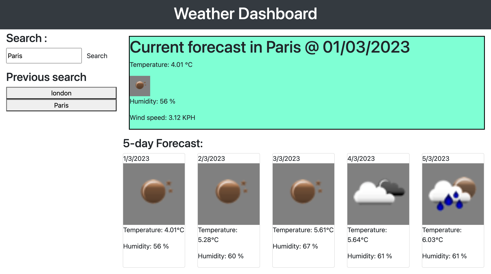

# Weather-dashboard App

## Description

An application, creating dynamic HTML and CSS using OpenWeather API to retrieve and store data about user's chosen cities.

## Features

Weather dashboard application that enables user to check weather information by entering city name.

## Usage

Run the website, input a city name and view weather report.

## Screenshot

## Link
https://princeultim8.github.io/Weather-dashboard/

